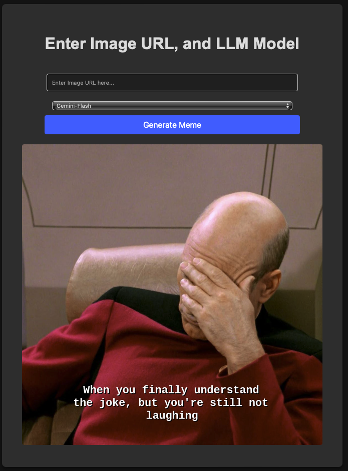

# GenAI Assessment
This repository contains the code for the GenAI assessment.

- [x] Code
    - [x] Meme Generator with Image Description
    - [x] Binary Classification

## Install
This installs the dependencies for the both the meme generator with image description and the binary classification.
```bash
conda create -n bmw python=3.12 -y
conda activate bmw
pip install -r requirements.txt
```

## Meme Generator with Image Description

### Overview

A meme generator that takes an image url/path as an input, generates a latent description that contains the objects and the scene of the image, then generates a meme.



### Architecture
The architecture of the meme generator is as follows:
- Computer Vision (CV) Module: I opt for am free open-source vision-language model called [LLaVa](https://huggingface.co/llava-hf/llava-1.5-7b-hf), it is an open-source chatbot trained by fine-tuning LLaMA/Vicuna on GPT-generated multi-modal instruction-following data. It is an auto-regressive language model, based on the transformer architecture.

- Meme Generator (MG) Module: Here, I have tried 2 models. 
    - 1st Model: I used a meta's free open-source large Language Model (LLM) called [LLama 3.1-8B-Instruct](https://huggingface.co/meta-llama/Meta-Llama-3.1-8B-Instruct). To use this model, you need to grant access to the model from the model's page on Hugging Face. You can get the access within 30 minutes.
    - 2nd Model: I used google's LLM called [Gemini-Flash](https://deepmind.google/technologies/gemini/flash/) thought its free API.

- Meme Assembler (MA) Module: The generated meme is then passed to this module to add the caption to the image in a meme format. The text's color is dynamically assigned based on the original image's color palette in order to be visible.

### Run the Meme Generator
After installing the dependencies, you need to create a `.env` file with the following environment variables:
```bash
HF_TOKEN=<your_hugging_face_token>
GEMINI_TOKEN=<your_gemini_token>
```
- For the `HF_TOKEN`, you can get it by going to [Hugging Face Settings](https://huggingface.co/settings/tokens) and creating a new token.
- For the `GEMINI_TOKEN`, you can get it by going to the [Gemini API page](https://ai.google.dev/gemini-api/docs/api-key) and create a new token.

Then, you can run the meme generator with the following command:
```bash
cd meme_generator_with_image_captioning/app
python app.py
```
After running the above command, you can go to the following appeared in the bash window to see the meme generator in action on your browser.

## Notes
- The first time you run the meme generator, it will take a while to download the models and load them.
- Make sure to allow pop-ups in your browser to see the meme generator errors pop-ups.
- In the computer vision model and the meme generator model, you can use any hugging face models by just changing the model name.
- Do not forget to change `cache_dir` in the `ImageContextRecognition` and `LLaMa3MemeCaptionGeneration` classes to the directory where you want to download the models.
- This method accepts both image url or local image path as an input.


## Challenges

1- Finding the right model for the image CV module:
-  I was not sure about using LVM or not, but I realized that the next step is to create a meme using LLM, so I need a textual output from the CV model to be passed and process by the LLM in MG module.
- After trying various models, such as [blip](https://huggingface.co/Salesforce/blip-image-captioning-large) that was not good at generating a descriptive text for the images. So, I decided to use `LLaVa` because I can somehow control its output using simple prompt engineering.

2- Limited Resources:
- However, these models are free and open-source, they still requires a lot of resources to run. I tried to run the models on my local machine but it was not possible due to my limited resources. So, I tried to run it on the free version of google colab but I did not manage to load both `LLama 3.1-8B-Instruct` and `LLaVa` at the same time or even one of them alone.

- Solution: I used quantization technique such as loading in `float16` instead of `float32` to reduce the size of the models and make it possible to run on my free version of google colab using only one `T4` GPU with `15GB` of memory.


